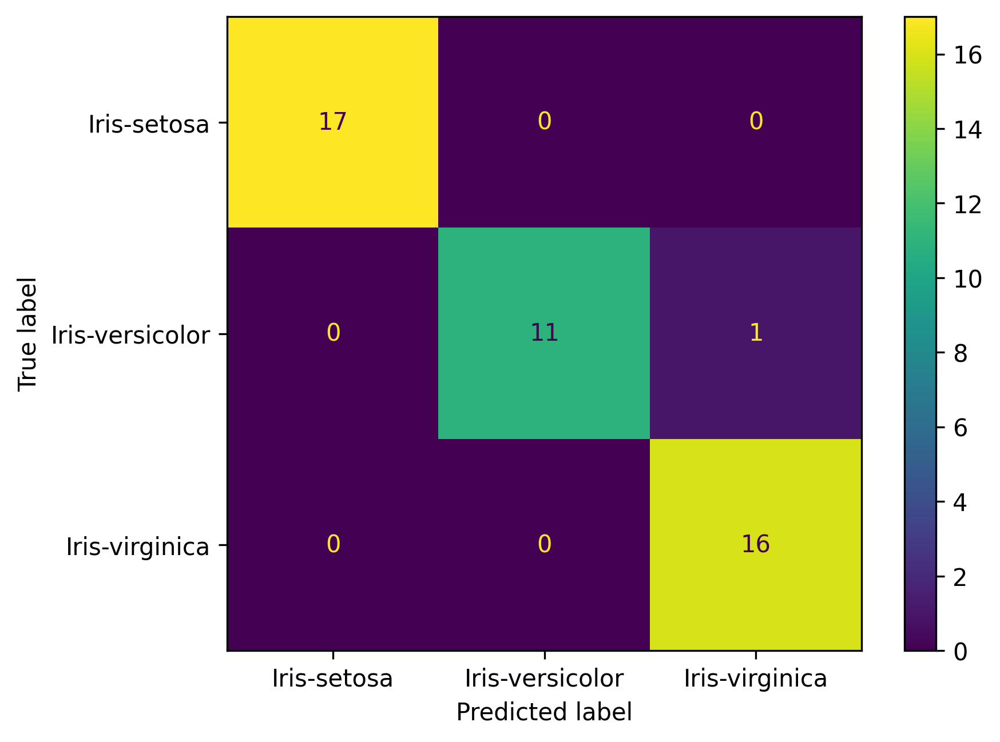

# Iris Flower Classification

A simple machine learning classification project that predicts the species of an iris flower based on four features: **sepal length, sepal width, petal length, and petal width**.

---

## 📊 Dataset
- **Source**: https://www.kaggle.com/datasets/arshid/iris-flower-dataset
- **File**: `IRIS.csv` is included in this repository.

---

## ⚙️ Methods
Steps covered in `iris.ipynb`:
1. **Exploratory Data Analysis (EDA)**
   - Checked duplicates, missing values, class distribution
   - Plotted feature distributions & correlations

2. **Preprocessing**
   - Applied feature scaling: StandardScaler and RobustScaler

3. **Modeling**
   - Compared Logistic Regression and Decision Tree Classifier
   - Cross-validation & hyperparameter tuning with GridSearchCV

4. **Evaluation**
   - Cross validation to get accuracy score
   - Learning Curve
   - Confusion Matrix
   - Classification Report

---

## 🏆 Results
- **Best Model**: Logistic Regression
- **Accuracy (test set)**: `0.98`
- **Confusion Matrix**:
  

---
